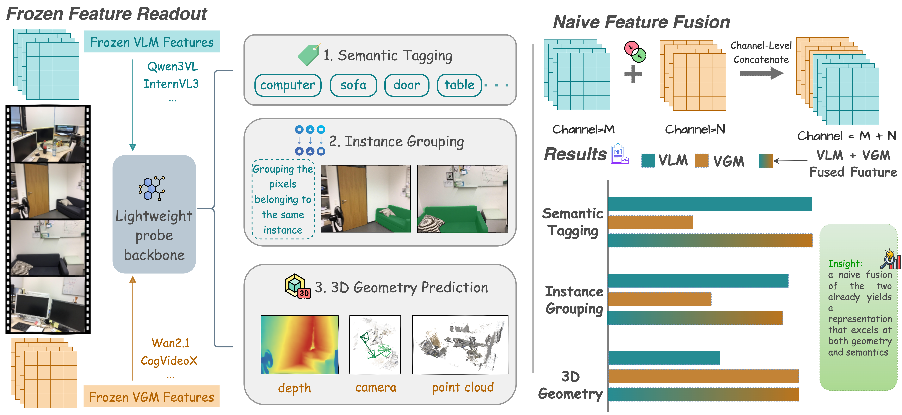
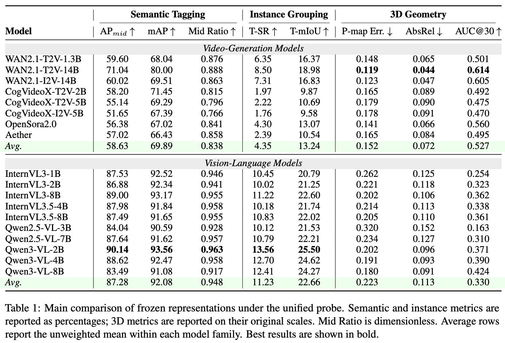

# Probing-VLM-VGM

[](https://arxiv.org/abs/2605.28132)

Official code for **"Which Pretraining Paradigm Better Serves Spatial Intelligence? An Empirical Comparison of Vision-Language and Video Generation Models."**

This repository provides a unified frozen-feature probing framework for comparing **Vision-Language Models (VLMs)** and **Video Generation Models (VGMs)** across three representative axes of spatial intelligence:

- 🏷️ **Semantic tagging**: which object categories are visible in a video clip?
- 🧩 **Instance grouping**: which pixels across views belong to the same object instance?
- 🌐 **3D geometry prediction**: how well do frozen features support point maps, depth, and camera motion?



Our experiments show a clear complementarity: **VLMs are stronger at semantic and object-centric understanding**, while **VGMs provide more accessible dense geometry and camera-motion signals**. A simple feature-level fusion of VLM and VGM representations already improves both sides, suggesting a promising direction for stronger spatial-intelligence backbones.



## 📦 Repository Structure

```text
probing_vlm_vgm/        # Probe models, datasets, losses, metrics, and training entry point
configs/                # Hydra configs for semantic tagging, instance grouping, and 3D geometry
features/               # Frozen feature extraction wrappers for VLMs and VGMs
data/                   # User-provided datasets and extracted features (ignored by git)
ckpt/                   # User-provided model checkpoints (ignored by git)
```

## 🛠️ Installation

```bash
conda create -n probing-vlm-vgm python=3.11 -y
conda activate probing-vlm-vgm

# Install PyTorch. Please adjust the CUDA version to your system.
pip install torch==2.6.0 torchvision==0.21.0 torchaudio==2.6.0

# Install PyTorch3D. This can take a while.
pip install "git+https://github.com/facebookresearch/pytorch3d.git@stable" --no-build-isolation

# Install dependencies and this package.
pip install -r requirements.txt
pip install -e .
```

By default, all llm-based feature extraction uses the PyTorch `sdpa` attention
backend for compatibility. If your machine has a compatible FlashAttention 2
build, you can optionally install it and pass
`--attn-implementation flash_attention_2`:

```bash
pip install flash-attn --no-build-isolation
```

The training code uses Hydra configs and expects `PROJECT_ROOT` to point to this repository:

```bash
export PROJECT_ROOT=/path/to/Probing-VLM-VGM
python -m probing_vlm_vgm.train --help
```


## 📚 Data Preparation

### ScanNet

ScanNet is distributed under its own Terms of Use and requires users to request access from the [official ScanNet Repository](https://github.com/ScanNet/ScanNet). Please visit it and download the dataset.

We provide a separate ScanNet preprocessing guide:
[docs/scannet_process.md](docs/scannet_process.md). It explains how to export
`.sens` files, organize official train/val splits, build 81-frame clips,
generate semantic-tagging labels, and prepare CLIP class-name embeddings.

After preprocessing, the expected layout is:

```text
data/ScanNet/
  ScanNet-processed/
    train.json
    val.json
    class_names_20.json
    train/
      scene0000_00/
        frames/frame_00000.jpg ... frame_00080.jpg
        instance_masks.npy
        poses.npy
        intrinsic.txt
        metadata.sft
        tag_pixel_counts_20.npy
  FEAT/
```

ScanNet is used for:

- 🏷️ Semantic tagging
- 🧩 Instance grouping

### DL3DV

DL3DV is used for 3D geometry probing. Download the `1K`--`6K` subsets of
[DL3DV-ALL-960P](https://huggingface.co/datasets/DL3DV/DL3DV-ALL-960P) and place
the raw videos/frames under `data/DL3DV/DL3DV-ALL-960P/`. We then use VGGT to
construct the 3D task ground truth, including point maps, depth maps, camera
poses, and confidence maps.


To build the VGGT-generated 3D ground truth, run:

```bash
python -m probing_vlm_vgm.data.processing.process_dl3dv_multigpu \
  --root data/DL3DV \
  --subset all \
  --gpus 0,1,2,3,4,5,6,7 \
  --model-path facebook/VGGT-1B \
  --num-frames 150
```

This reads scenes from `data/DL3DV/DL3DV-ALL-960P/` and writes processed targets
to `data/DL3DV/DL3DV-processed/`. After processing, create the training and
validation split:

```bash
python -m probing_vlm_vgm.data.processing.dl3dv.create_split \
  --root data/DL3DV/DL3DV-processed \
  --subset all \
  --val-ratio 0.1 \
  --seed 0 \
  --out-dir data/DL3DV/DL3DV-processed
```

The geometry supervision follows the paper setup: VGGT-generated point maps, depth maps, camera poses, and confidence maps are used as probe targets.

## ❄️ Frozen Feature Extraction

The probe is trained on frozen intermediate features. We provide feature extraction wrappers under `features/`.

Supported model families include:

- 🎥 **VGMs**: 
  - [Wan2.1-T2V-1.3B](https://huggingface.co/Wan-AI/Wan2.1-T2V-1.3B-Diffusers)
  - [WAN2.1-T2V-14B](https://huggingface.co/Wan-AI/Wan2.1-T2V-14B-Diffusers)
  - [WAN2.1-I2V-14B](https://huggingface.co/Wan-AI/Wan2.1-I2V-14B-480P-Diffusers)
  - [CogVideoX-T2V-2B](https://huggingface.co/zai-org/CogVideoX-2b)
  - [CogVideoX-T2V-5B](https://huggingface.co/zai-org/CogVideoX-5b)
  - [CogVideoX-I2V-5B](https://huggingface.co/zai-org/CogVideoX-5b-I2V)
  - [OpenSora2.0](https://huggingface.co/hpcai-tech/Open-Sora-v2)
  - Aether
  
- 🖼️ **VLMs**:
  - [InternVL3-1B](https://huggingface.co/OpenGVLab/InternVL3-1B)
  - [InternVL3-2B](https://huggingface.co/OpenGVLab/InternVL3-2B)
  - [InternVL3-8B](https://huggingface.co/OpenGVLab/InternVL3-8B)
  - [InternVL3.5-4B](https://huggingface.co/OpenGVLab/InternVL3_5-4B)
  - [InternVL3.5-8B](https://huggingface.co/OpenGVLab/InternVL3_5-8B)
  - [Qwen2.5-VL-3B](https://huggingface.co/Qwen/Qwen2.5-VL-3B-Instruct)
  - [Qwen2.5-VL-7B](https://huggingface.co/Qwen/Qwen2.5-VL-7B-Instruct)
  - [Qwen3-VL-2B](https://huggingface.co/Qwen/Qwen3-VL-2B-Instruct)
  - [Qwen3-VL-4B](https://huggingface.co/Qwen/Qwen3-VL-4B-Instruct)
  - [Qwen3-VL-8B](https://huggingface.co/Qwen/Qwen3-VL-8B-Instruct)
  - [Qwen3.5-4B](https://huggingface.co/Qwen/Qwen3.5-4B)

The Qwen3.5 extractor requires the SpatialStack-compatible
`transformers==5.3.0` environment. Its example layer 20 is a normalized-depth
baseline relative to Qwen3-VL-8B layer 22, not a paper-validated layer choice.
Plain Qwen3.5 SFT checkpoints are compatible; geometry-enabled SpatialStack
checkpoints need a separate extractor that supplies their geometry inputs.

### DL3DV Examples

```bash
# DL3DV VGM features: WAN2.1-T2V-14B, layer 20, timestep 749.
python -m features.run_dl3dv \
  --vfm wan \
  --vfm-name wan-t2v-14b \
  --subset all \
  --dl3dv-root data/DL3DV/DL3DV-ALL-960P \
  --out-root data/DL3DV/FEAT \
  --model-id ckpt/Wan2.1-T2V-14B-Diffusers \
  --prompt "" \
  --output-layers 20 \
  --t 749

# DL3DV VLM features: Qwen3-VL-8B, layer 22.
python -m features.run_dl3dv \
  --vfm qwen3vl \
  --vfm-name qwen3-vl-8b \
  --subset all \
  --dl3dv-root data/DL3DV/DL3DV-ALL-960P \
  --out-root data/DL3DV/FEAT \
  --model-path ckpt/Qwen3-VL-8B-Instruct \
  --model-type qwen3vl \
  --use-query-frame-indices \
  --context-len 76 \
  --query-idx-divisor 4 \
  --output-layers 22

# DL3DV VLM features: Qwen3.5-4B, layer 20.
python -m features.run_dl3dv \
  --vfm qwen35 \
  --vfm-name qwen3.5-4b \
  --subset all \
  --dl3dv-root data/DL3DV/DL3DV-ALL-960P \
  --processed-root data/DL3DV/DL3DV-processed \
  --out-root data/DL3DV/FEAT \
  --model-path Qwen/Qwen3.5-4B \
  --model-type qwen35 \
  --use-query-frame-indices \
  --context-len 76 \
  --query-idx-divisor 4 \
  --output-layers 20

# DL3DV visual-encoder features: Qwen3.5-4B, layer sweep.
python -m features.run_dl3dv \
  --vfm qwen35 \
  --vfm-name qwen3.5-4b-visual \
  --subset all \
  --dl3dv-root data/DL3DV/DL3DV-ALL-960P \
  --processed-root data/DL3DV/DL3DV-processed \
  --out-root data/DL3DV/FEAT \
  --model-path Qwen/Qwen3.5-4B \
  --model-type qwen35-visual \
  --use-query-frame-indices \
  --context-len 76 \
  --query-idx-divisor 4 \
  --output-layers 1 5 9 13 17 21 24

# DL3DV VGM features: VGGT-Omega, cached geometry layers.
python -m features.run_dl3dv \
  --vfm vggt_omega \
  --vfm-name vggt-omega \
  --subset all \
  --dl3dv-root data/DL3DV/DL3DV-ALL-960P \
  --processed-root data/DL3DV/DL3DV-processed \
  --out-root data/DL3DV/FEAT \
  --model-path ckpt/vggt_omega_1b_512.pt \
  --use-query-frame-indices \
  --context-len 76 \
  --query-idx-divisor 4 \
  --output-layers 4 11 17 23
```

### ScanNet Examples

The following commands extract the ScanNet features used by the semantic
tagging and instance grouping probes. Features are written to
`data/ScanNet/FEAT/<model-name>/<split>/<scene_id>/`.

```bash
# ScanNet VGM features: WAN2.1-T2V-14B, layer 18, timestep 749.
python -m features.run_scannet \
  --vfm wan \
  --vfm-name wan-t2v-14b \
  --split both \
  --scannet-root data/ScanNet/ScanNet-processed \
  --out-root data/ScanNet/FEAT \
  --model-id ckpt/Wan2.1-T2V-14B-Diffusers \
  --prompt "" \
  --output-layers 18 \
  --t 749

# ScanNet VLM features: Qwen3-VL-8B, layer 22.
python -m features.run_scannet \
  --vfm qwen3vl \
  --vfm-name qwen3-vl-8b \
  --split both \
  --scannet-root data/ScanNet/ScanNet-processed \
  --out-root data/ScanNet/FEAT \
  --model-path ckpt/Qwen3-VL-8B-Instruct \
  --model-type qwen3vl \
  --use-query-frame-indices \
  --context-len 76 \
  --query-idx-divisor 4 \
  --output-layers 22
```

Different feature extractors may require different checkpoint paths, input resolutions, or layer/timestep choices. See the docstring at the top of each `features/*/extract_features.py` file for model-specific examples.


## 🚀 Training and Evaluation

All tasks use the same entry point:

```bash
python -m probing_vlm_vgm.train experiment=<task>/<model> job_name=<run_name>
```

### Semantic Tagging

The following examples reproduce the ScanNet semantic-tagging probe for
Qwen3-VL-8B and WAN2.1-T2V-14B. The default configs use the paper settings:
8 sampled views, batch size 8, 10 epochs, ScanNet20 labels, Qwen3-VL layer 22,
and WAN layer 18 at timestep 749. Semantic tagging also needs the CLIP text
initialization file `data/ScanNet/clip_class_embeds_20_vitl14.npy`, which can
be built during ScanNet preprocessing.

```bash
# Qwen3-VL-8B semantic-tagging probe.
CUDA_VISIBLE_DEVICES=0 python -m probing_vlm_vgm.train \
  experiment=scannet_tagging/qwen3-vl-8b \
  job_name=qwen3-vl-8b \
  trainer.devices=1

# WAN2.1-T2V-14B semantic-tagging probe.
CUDA_VISIBLE_DEVICES=0 python -m probing_vlm_vgm.train \
  experiment=scannet_tagging/wan-t2v-14b \
  job_name=wan-t2v-14b \
  trainer.devices=1
```

The resulting checkpoints are saved under:

```text
logs/scannet-tagging/runs/
  vlm_scannet-tagging_qwen3-vl-8b/
  vg_scannet-tagging_wan-t2v-14b/
```

Evaluate the trained semantic-tagging probes:

```bash
# Add --dry-run first if you want to inspect the selected runs.
WANDB_MODE=offline CUDA_VISIBLE_DEVICES=0 bash scripts/eval_scannet_tagging.sh \
  --views 8 \
  --vfm qwen3-vl-8b \
  --vfm wan-t2v-14b \
  --skip-done
```

Evaluation writes new runs to `logs/scannet-tagging-eval/runs/`. The main
semantic-tagging metrics can then be exported as a CSV:

```bash
python scripts/parse_results.py \
  --groups scannet-tagging-eval \
  --runs "vlm_scannet-tagging-eval_qwen3-vl-8b;vg_scannet-tagging-eval_wan-t2v-14b" \
  --metrics "val/AP_mid,val/mAP,val/Mid_Ratio" \
  --joint-name scannet-tagging-main
```

### Instance Grouping

The following examples reproduce the ScanNet instance-grouping probe for
Qwen3-VL-8B and WAN2.1-T2V-14B. The default configs use the paper settings:
8 sampled views, batch size 8, 40 epochs, Qwen3-VL layer 22, and WAN layer 18
at timestep 749.

```bash
# Qwen3-VL-8B instance-grouping probe.
CUDA_VISIBLE_DEVICES=0,1 python -m probing_vlm_vgm.train \
  experiment=scannet/qwen3-vl-8b \
  job_name=qwen3-vl-8b \
  trainer.devices=2

# WAN2.1-T2V-14B instance-grouping probe.
CUDA_VISIBLE_DEVICES=0,1 python -m probing_vlm_vgm.train \
  experiment=scannet/wan-t2v-14b \
  job_name=wan-t2v-14b \
  trainer.devices=2
```

The resulting checkpoints are saved under:

```text
logs/scannet-instance/runs/
  vlm_scannet-instance_qwen3-vl-8b/
  vg_scannet-instance_wan-t2v-14b/
```

Evaluate the trained instance probes with sharded HDBSCAN clustering:

```bash
# Add --dry-run first if you want to inspect the selected runs.
WANDB_MODE=offline CUDA_VISIBLE_DEVICES=0,1 python scripts/eval_scannet_instance_sharded.py \
  --views 8 \
  --gpus 0,1 \
  --vfm qwen3-vl-8b \
  --vfm wan-t2v-14b \
  --output-root logs/scannet-instance-eval-sharded \
  --hdbscan-workers 8 \
  --num-workers 2 \
  --skip-done
```

Evaluation writes new runs to `logs/scannet-instance-eval-sharded/runs/`. The
main instance-grouping metrics can then be exported as a CSV:

```bash
python scripts/parse_results.py \
  --groups scannet-instance-eval-sharded \
  --runs "vlm_scannet-instance-eval_qwen3-vl-8b;vg_scannet-instance-eval_wan-t2v-14b" \
  --metrics "val/t_miou,val/t_sr" \
  --joint-name scannet-instance-main
```

### 3D Geometry

The following examples reproduce the DL3DV 3D-geometry probe for
Qwen3-VL-8B and WAN2.1-T2V-14B. The default configs use the paper settings:
4 sampled views, batch size 10, 60 epochs, Qwen3-VL layer 22, and WAN layer 20
at timestep 749.

```bash
# Qwen3-VL-8B 3D probe.
CUDA_VISIBLE_DEVICES=0,1 python -m probing_vlm_vgm.train \
  experiment=dl3dv/qwen3-vl-8b \
  job_name=qwen3-vl-8b \
  trainer.devices=2

# Qwen3.5-4B single-layer 3D probe. Override feat_postfix for the layer sweep.
CUDA_VISIBLE_DEVICES=0,1 python -m probing_vlm_vgm.train \
  experiment=dl3dv/qwen3.5-4b \
  job_name=qwen3.5-4b_layer17_seed42 \
  data.data_root=/path/to/DL3DV/DL3DV-processed \
  data.feat_root=/path/to/DL3DV/FEAT \
  feat_postfix=_layer17 \
  trainer.devices=2

# Qwen3.5-4B visual-encoder single-layer 3D probe.
CUDA_VISIBLE_DEVICES=0,1 python -m probing_vlm_vgm.train \
  experiment=dl3dv/qwen3.5-4b-visual \
  job_name=qwen3.5-4b-visual_layer17_seed42 \
  data.data_root=/path/to/DL3DV/DL3DV-processed \
  data.feat_root=/path/to/DL3DV/FEAT \
  feat_postfix=_layer17 \
  trainer.devices=2

# VGGT-Omega single-layer 3D probe. Override feat_postfix for the layer sweep.
CUDA_VISIBLE_DEVICES=0,1 python -m probing_vlm_vgm.train \
  experiment=dl3dv/vggt-omega \
  job_name=vggt-omega_layer23_seed42 \
  data.data_root=/path/to/DL3DV/DL3DV-processed \
  data.feat_root=/path/to/DL3DV/FEAT \
  feat_postfix=_layer23 \
  trainer.devices=2

# WAN2.1-T2V-14B 3D probe.
CUDA_VISIBLE_DEVICES=0,1 python -m probing_vlm_vgm.train \
  experiment=dl3dv/wan-t2v-14b \
  job_name=wan-t2v-14b \
  trainer.devices=2
```

For the visual-encoder probe, Qwen3.5 has `vision_config.hidden_size=1024` and
`vision_config.depth=24`; the config therefore defaults to `vfm_channels=1024`
and the recommended layer sweep is `1 5 9 13 17 21 24`.

The resulting checkpoints are saved under:

```text
logs/dl3dv/runs/
  vlm_dl3dv_qwen3-vl-8b/
  vg_dl3dv_wan-t2v-14b/
```

Evaluate the trained 3D probes on the DL3DV validation split:

```bash
# Add --dry-run first if you want to inspect the expanded commands.
WANDB_MODE=offline CUDA_VISIBLE_DEVICES=0 bash scripts/eval_dl3dv.sh \
  --views 4 \
  --vfm qwen3-vl-8b \
  --vfm wan-t2v-14b \
  --task-name dl3dv-eval-main \
  --skip-done

# Qwen3.5-4B visual-encoder probes use a custom run root.
CUDA_VISIBLE_DEVICES=0 bash scripts/eval_dl3dv.sh \
  --runs-dir /project/peilab/jys/probing/DL3DV/qwen3.5-4b-visual \
  --job-suffix _eval \
  --views 4 \
  --vfm qwen3.5-4b-visual \
  --task-name dl3dv-eval-qwen35-visual \
  --project 3D-Geometry \
  --skip-done

# VGGT-Omega probes use a custom run root.
CUDA_VISIBLE_DEVICES=0 bash scripts/eval_dl3dv.sh \
  --runs-dir /project/peilab/jys/probing/DL3DV/vggt-omega \
  --job-suffix _eval \
  --views 4 \
  --vfm vggt-omega \
  --task-name dl3dv-eval-vggt-omega \
  --project 3D-Geometry \
  --skip-done
```

Evaluation writes new runs to `logs/dl3dv-eval-main/runs/`. The main 3D
metrics can then be exported as a CSV:

```bash
python scripts/parse_results.py \
  --groups dl3dv-eval-main \
  --runs "vlm_dl3dv-eval-main_qwen3-vl-8b;vg_dl3dv-eval-main_wan-t2v-14b" \
  --metrics "val/pmap_mse_aligned,val/depth_abs_rel,val/Auc_30" \
  --joint-name dl3dv-main
```

The CSV is written to `logs/metrics/dl3dv-eval-main/dl3dv-main.csv`.

Hydra overrides can be used to change paths, feature layers, batch sizes, or
probe settings:

```bash
python -m probing_vlm_vgm.train \
  experiment=dl3dv/qwen3-vl-8b \
  job_name=qwen3-vl-8b_layer22 \
  data.feat_root=/path/to/DL3DV/FEAT \
  feat_postfix=_layer22
```

## 🔗 Feature Fusion

The paper's fusion baseline is built offline after extracting both WAN2.1-T2V-14B
and Qwen3-VL-8B features. We resize WAN features to the Qwen token grid, apply
per-token LayerNorm to each branch independently, concatenate along channels,
and save the fused features as `wan-t2v-14b-qwen3-vl-8b-lnconcat`.

```bash
# DL3DV fusion features for 3D geometry.
python scripts/build_dl3dv_wan_t2v_14b_qwen3_vl_8b_lnconcat.py \
  --processed-root data/DL3DV/DL3DV-processed \
  --wan-feat-root data/DL3DV/FEAT \
  --qwen-feat-root data/DL3DV/FEAT \
  --out-feat-root data/DL3DV/FEAT \
  --splits train val

# ScanNet fusion features for semantic tagging and instance grouping.
python scripts/build_scannet_wan_t2v_14b_qwen3_vl_8b_lnconcat.py \
  --processed-root data/ScanNet/ScanNet-processed \
  --feat-root data/ScanNet/FEAT \
  --splits train val
```

After this step, train the fusion probes with the corresponding configs:

```bash
# 3D geometry fusion probe.
python -m probing_vlm_vgm.train \
  experiment=dl3dv/wan-t2v-14b-qwen3-vl-8b-lnconcat \
  job_name=wan-t2v-14b-qwen3-vl-8b-lnconcat

# Instance-grouping fusion probe.
python -m probing_vlm_vgm.train \
  experiment=scannet/wan-t2v-14b-qwen3-vl-8b-lnconcat \
  job_name=wan-t2v-14b-qwen3-vl-8b-lnconcat

# Semantic-tagging fusion probe.
python -m probing_vlm_vgm.train \
  experiment=scannet_tagging/wan-t2v-14b-qwen3-vl-8b-lnconcat \
  job_name=wan-t2v-14b-qwen3-vl-8b-lnconcat
```


## 🧾 Citation

If you find this project useful, please cite:

```bibtex
@article{shen2026probingvlmvgm,
  title={Which Pretraining Paradigm Better Serves Spatial Intelligence? An Empirical Comparison of Vision-Language and Video Generation Models},
  author={Shen, Haozhan and Zhao, Tiancheng and Zhao, Kangjia and Yin, Jianwei},
  journal={arXiv preprint arXiv:2605.28132},
  year={2026}
}
```

## 🙏 Acknowledgments

This codebase builds on and adapts components from several excellent open-source projects, including **VidFM3D**, **VGGT**, and feature extraction code or model interfaces from the evaluated VLM/VGM families. We thank the authors for making their implementations available.

Please refer to the original repositories and model cards for the licenses and terms of use of each dataset, model, and external dependency.
